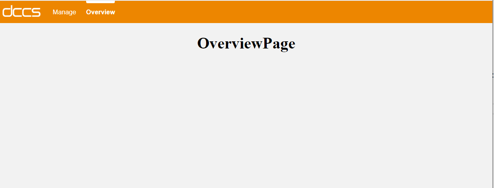
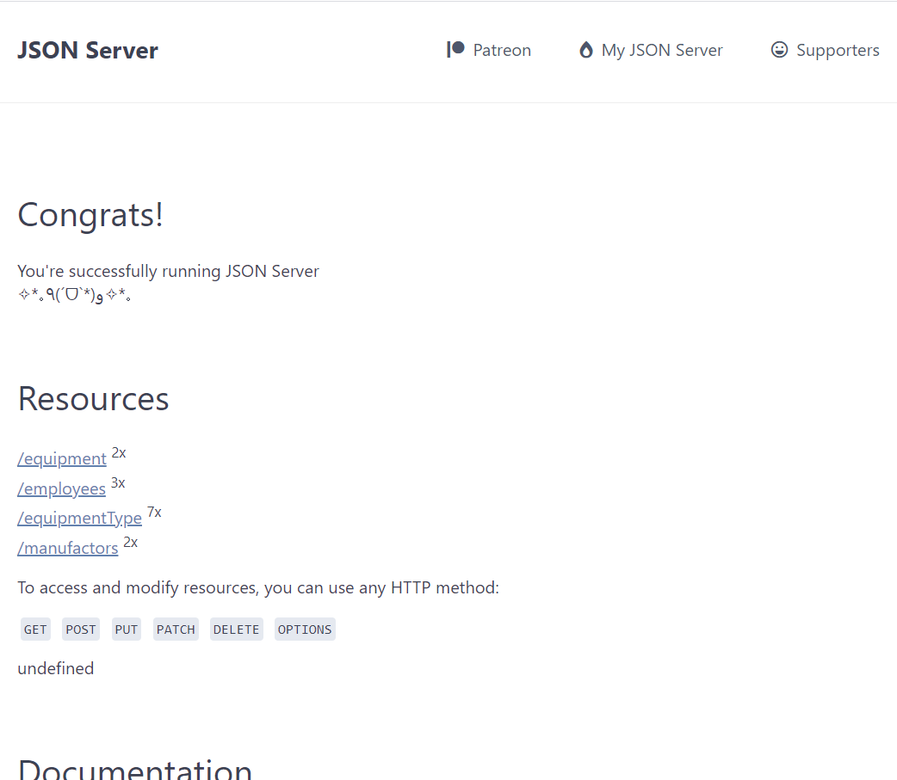

# react-dccs-starter-kit

## Lecture 1:

This showcase has following functionalities:

- implementation of components like header, menu items, empty pages
- implementation react router
- mock rest api based on JSON Server

<h4>Application layout</h4>
<h4>API overview</h4>
<h4>Example of employees API</h4>
